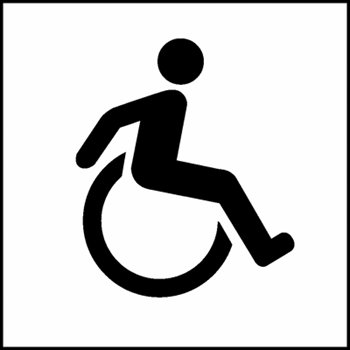

# "O que faz uma cidade inteligente?"

Quando decidimos participar da competição, esta era a maior dúvida que tínhamos, 
e logo notamos que o conceito de _cidade inteligente_ era muito amplo...

> * Uma cidade que seja auto-suficiente?
> * Uma cidade que facilite as tarefas diárias?
> * Uma cidade em que todos participem?

Percebemos, então, que antes desta, precisávamos responder outra pergunta:

## "O que é uma cidade?"

> Seria uma área geográfica delimitada?
> 
> O estatuto que reconhece esta área como uma organização política?

**NÃO!**

Uma cidade, é feita de pessoas. Mais do que isso...

_**A cidade, são as pessoas.**_

Com isso esclarecido, conseguimos chegar no que seria o principal quesito da 
nosso _app_, que é...

## Integração

...E se esta seria nossa maior preocupação, o desafio era propor uma forma de
garantir que todos tivessem as mesmas facilidades. Por isso voltamos nossa 
atenção para algo muito importante, algo que, infelizmente, é muitas vezes deixado 
de lado, ou lhe é dado pouca atenção.

### _Acessibilidade_

# Acesso à locais de cultura, diversão e comércio

Existem muitos aplicativos preocupados em ajudar o usuário e encontrar a melhor
festa para ir com os amigos, o melhor restaurante da cidade, o maior museu, etc.

Mas quantos destes se dedicam ao deficiênte fisico?

Ainda, como podemos saber se o melhor restaurante ou o maior museu estão preparados
para receber um cadeirante? Ou auxiliar um cego a ler seus guias?

## Tenho Acesso

O _Tenho Acesso_ surgiu para satisfazer esta necessidade.

### Busca orientada

Utilizando um sistema simples e intuitivo de busca orientada, o usuário é capaz
de localizar rapidamente os locais em sua área que melhor se adequem as suas 
expectativas.

### Relevância

Utilizando a inteligência da _rede_, o _Tenho Acesso_ personaliza as buscas para
cada usuário, classificando os resultados pela relevância destes de acordo com...

* Locais mais próximos
* Mais visitados por amigos
* Mais pessoas gostaram
* Que possuam melhorias voltadas à acessibilidade
* etc.

### Classificação visual

Pouco adianta presentar o usuário com números ou estrelas que podem nem ser
percebidos. O que mais chama atenção, é o qúe está mais evidente.

O _Tenho Acesso_ exibe, de uma forma simples e intuitiva, os resultados mais
relevantes com maior tamanho e destaque, misturando conceitos de _tag cloud_
com tendências modernas de _flat design_.

_**"O que você vê primeiro, é o melhor para você."**_

### Auto aperfeiçoamento

O _Tenho Acesso_ é um aplicativo que aprende com o uso, melhorando cada vez
mais a experiência do usuário.

Se o usuário frequenta muitos museus, as categorias voltadas para _Arte_ terão
maior relevância para ele. Se ele almoça com frequência comida japonesa, 
restaurantes japoneses terão maior relevância para ele no horário de almoço.

#### Gostei ou não gostei?

Após visitar um local, o _Tenho Acesso_ pergunta ao usuário se gostou ou não do 
mesmo. 

Simples assim, a forma de avaliação mais rápida, fácil e efetiva.

Adicionalmente, o usuário tem a opção de informar que melhoras o local possui
(ou não) para seu tipo de deficiência. Dessa forma mantendo a base de dados 
sempre atualizada.

# Oportunidades de negócio

Como estamos falando de locais, obviamente incluímos estabelecimentos comerciais,
e com estes também vem oportunidades de negócio.

Estabelecimentos podem optar por adicionar conteúdo específico no aplicativo,
inclusive aumentando sua relevância nas buscas

Esses conteúdos podem ser...

* links patrocinados
* _banners_ (em lugar de seus _tiles_ informativos)
* promoções
* etc.

## Relatórios de receptividade e oportunidades melhorias

Os etabelecimentos podem ainda acessar relaórios detalhados, fornecidos
pelo _Tenho Acesso_, exibindo como seu público tem qualificado o local,
quais seus pontos fortes e oportunidades de melhoria.

Enfim, ver como fazer para deixar o local ainda melhor e mais acolhedor.

# Mais opções, mais oportunidades, mais integração...

O sistema de busca orientada do _Tenho Acesso_ pode ainda ser adaptado
facilmente para outros públicos, ou outras necessidades.

* Cervejas disponíveis em bares, combinando com a preferência do usuário
* Promoções em lojas locais, combinando com produtos e serviços mais consumidos pelo usuário
* etc.