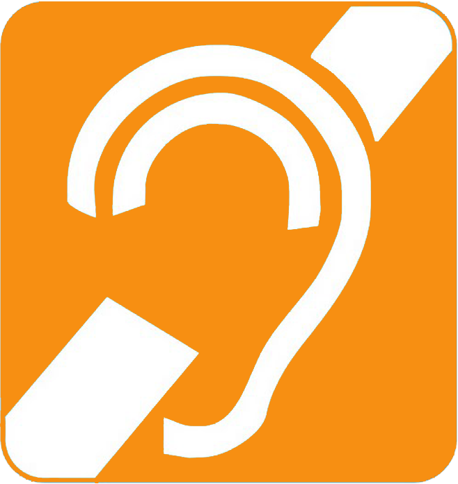
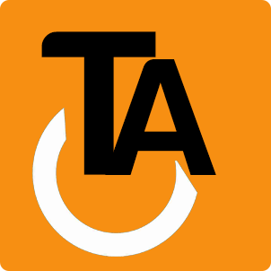

.. title:: City Rumble

:css: content.css

-----------------------------

:id: splash-cityrumble

.. image:: img/city-rumble.jpg
    :width: 800

-----------------------------

:data-x: r1400

*"Como se faz uma cidade inteligente?"*

.. note::
    Quando decidimos participar da competição, esta era a maior dúvida que tínhamos, 
    e logo notamos que o conceito de *cidade inteligente* era muito amplo...

        * Uma cidade que seja auto-suficiente?
        * Uma cidade que facilite as tarefas diárias?
        * Uma cidade em que todos participem?

    Percebemos, então, que antes desta, precisávamos responder outra pergunta:

-----------------------------

:data-x: r0
:data-rotate-x: -90

*"O que é uma cidade?"*

.. note::
        Seria uma área geográfica delimitada?
        
        O estatuto que reconhece esta área como uma organização política?

-----------------------------

:data-x: r1400

**Uma cidade, é feita de pessoas.**

.. note::
    Mais do que isso...

-----------------------------

:data-x: r0
:data-rotate-x: 0

**A cidade, são as pessoas.**

.. note::
    Com isso esclarecido, conseguimos chegar no que seria o principal quesito da 
    nosso *app*, que é...

-----------------------------

:data-x: 0
:data-y: r1000

Integração
==========

uma forma de garantir que todos tenham as mesmas facilidades

.. note::
    ...E se esta seria nossa maior preocupação, o desafio era propor uma forma de
    garantir que todos tivessem as mesmas facilidades. Por isso voltamos nossa 
    atenção para algo muito importante, algo que, infelizmente, é muitas vezes deixado 
    de lado, ou lhe é dado pouca atenção.

-----------------------------

:data-x: r1400

Acessibilidade
==============

.. image:: img/def-1.png
    :width: 200

.. image:: img/def-2.png
    :width: 200

-----------------------------

Acesso à locais 
===============

...de cultura, diversão e comércio

.. image:: img/foursquare.png
    :width: 100

.. image:: img/google-places.png
    :width: 100

.. image:: img/kekanto.png
    :width: 100

.. note::
    Existem muitos aplicativos preocupados em ajudar o usuário e encontrar a melhor
    festa para ir com os amigos, o melhor restaurante da cidade, o maior museu, etc.

    Mas quantos destes se dedicam ao deficiênte fisico?

    Ainda, como podemos saber se o melhor restaurante ou o maior museu estão preparados
    para receber um cadeirante? Ou auxiliar um cego a ler seus guias?

-----------------------------

:id: splash-ta
:data-scale: 0.6

.. class:: huge

Tenho Acesso

.. note::
    O *Tenho Acesso* foi criado para satisfazer esta necessidade.

-----------------------------

:id: equalize
:data-x: r0
:data-y: r200
:data-scale: 1

*Inteligente é equalizar*

.. note::
    de um dicionário qualquer na internet:
    
        "*Equalizar significa uniformizar, tornar igual.*"

    Este é o slogan do Tenho Acesso.

-----------------------------

:data-x: 0
:data-y: r1000

Busca orientada
===============

localizar rapidamente os locais em sua área que melhor se adequem 
as suas expectativas

.. note::
    Utilizando um sistema simples e intuitivo de busca orientada, o usuário é capaz
    de localizar rapidamente os locais em sua área que melhor se adequem as suas 
    expectativas.

-----------------------------

:data-x: r1400

Relevância
==========

utiliza a inteligência da rede

* locais mais próximos
* mais visitados por amigos
* mais pessoas gostaram
* que possuam melhorias voltadas à acessibilidade
* etc.

.. note::
    utilizando a inteligência da rede, o Tenho Acesso personaliza as buscas para
    cada usuário, classificando os resultados pela relevância destes de acordo com...

-----------------------------

Classificação visual
====================

resultados mais relevantes com maior tamanho e destaque

.. note::
    Pouco adianta presentar o usuário com números ou estrelas que podem nem ser
    percebidos. O que mais chama atenção, é o qúe está mais evidente.

    O *Tenho Acesso* exibe, de uma forma simples e intuitiva, os resultados mais
    relevantes com maior tamanho e destaque, misturando conceitos de *tag cloud*
    com tendências modernas de *flat design*.

-----------------------------

.. image:: img/screen01-categorias.jpg
    :height: 600

-----------------------------

:data-x: r0
:data-rotate-y: 90

.. image:: img/screen02-restaurantes-mod3.png
    :height: 600

.. note::
    Na lista de locais, são exibidos ícones demonstrando as melhorias
    voltadas para cada tipo de necessidade.

-----------------------------

:data-x: r1400
:data-rotate-y: 0

*"O que você vê primeiro, é o melhor para você."*

.. note::
    Esta é a ideia que o *Tenho Acesso* quer passar.

-----------------------------

:data-x: 0
:data-y: r1000

Auto aperfeiçoamento
====================

aprende com o uso

.. note::
    O *Tenho Acesso* é um aplicativo que aprende com o uso, melhorando cada vez
    mais a experiência do usuário.

    Se o usuário frequenta muitos museus, as categorias voltadas para *Arte* terão
    maior relevância para ele. Se ele almoça com frequência comida japonesa, 
    restaurantes japoneses terão maior relevância para ele no horário de almoço.

-----------------------------

:data-x: r1400

Avaliação de locais
===================

*gostou deste local?* (S/N)

opção de informar que melhorias o local possui

.. note::
    Após visitar um local, o *Tenho Acesso* pergunta ao usuário se gostou ou não do 
    mesmo. 

    Simples assim, a forma de avaliação mais rápida, fácil e efetiva.

    Adicionalmente, o usuário tem a opção de informar que melhoras o local possui
    (ou não) para seu tipo de deficiência. Dessa forma mantendo a base de dados 
    sempre atualizada.

-----------------------------

.. image:: img/screen-aval.jpg
    :height: 600

-----------------------------

:data-x: 0
:data-y: r1000

.. image:: img/money-bag.png
    :width: 300

.. note::
    Falamos muito sobre o público-alvo e facilidade de uso do aplicativo
    até agora.

    Chegou o momento de falarmos um pouco sobre nós, 
    sobre *o que ganhamos com isso?*

-----------------------------

:data-x: r1400

Monetização
===========

* links patrocinados
* banners
* promoções
* etc.

.. note::
    Como estamos falando de locais, obviamente incluímos estabelecimentos comerciais,
    e com estes também vem oportunidades de negócio.

    Estabelecimentos podem optar por adicionar conteúdo específico no aplicativo,
    inclusive aumentando sua relevância nas buscas

    Esses conteúdos podem ser...

-----------------------------

:data-x: r1400

Relatórios de receptividade 
===========================

...e oportunidades melhorias para os locais

.. note::
    Os estabelecimentos podem ainda acessar relatórios detalhados, fornecidos
    pelo *Tenho Acesso*, exibindo como seu público tem qualificado o local,
    quais seus pontos fortes e oportunidades de melhoria.

    Enfim, ver como fazer para deixar o local ainda melhor e mais acolhedor.

-----------------------------

Mais opções
===========

* ...mais oportunidades
* ...mais integração

.. note::
    O sistema de busca orientada do *Tenho Acesso* pode ainda ser adaptado
    facilmente para outros públicos, ou outras necessidades.

    * Cervejas disponíveis em bares, combinando com a preferência do usuário
    * Promoções em lojas locais, combinando com produtos e serviços mais consumidos pelo usuário
    * etc.

-----------------------------

:id: about-1
:data-x: 7000
:data-y: 0

grupo ``/tmp``
==============

* Blanda Mello
* Cladmir Lima
* Fabio Beneditto
* Mateus Fassina
* Paulo Diovani
* Vanessa Monni

-----------------------------

:id: about-2
:data-y: r1000

powered by `Hovercraft! <https://github.com/regebro/hovercraft/>`_

powered by `impress.js <https://github.com/bartaz/impress.js/>`_

-----------------------------

:id: overview
:data-x: 3500
:data-y: 2000
:data-scale: 7
