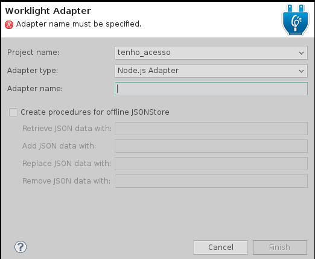

# Utilizando Adapters do Node.js com Worklight

> Este _mini how-to_ foi baseado no artigo [A preview of Node.js adapters in Worklight 6.0.0](https://www.ibm.com/developerworks/community/blogs/worklight/entry/a_preview_of_node_js_adapters_in_worklight_6_0_0?lang=en), por Alex Dvinsky.

## Instalando módulos do Node.js

O módulo necessário para se criar adapters do Worklight é o [WL](https://www.ibm.com/developerworks/community/blogs/worklight/resource/wl-0.0.1a.tgz).

Ele já está listado no `packages.json` da pasta `server/nodejs/`, bastanto, para 
instala-lo, executar o seguinte comando na pasta:

    npm install

## Configurando o IBM Websphere

O Worklight inicia um servidor websphere quando executad o _build and deploy_  de uma 
aplicação. É necessário preparar este servidor, adicionando algumas configurações ao
seu `web.xml`, tais como o caminho para o executável do Node.js e o _workarea_.

1. Localize o diretório `WorklightServerConfig/` em seu workspace do Eclipse 
    (este diretório é criado automaticamente pelo Worklight, dentro do workspace).
2. Localize, dentro deste diretório, o arquivo `servers/worklight/apps/TMP.war`.
3. Abra o arquivo (é um arquivo zip comum) e localize o xml `WEB-INF/web.xml` e adicione
    seguintes linhas (alterando de acordo com o seu ambiente):

        <!-- The URL of NodeCallbackServlet of your Worklight server
             The URL will be in the format of http://<WL server host>:<WL server port>/<ProjectName>/node/integration
         -->
        <env-entry>
             <env-entry-name>node/integrationUrl</env-entry-name>
             <env-entry-type>java.lang.String</env-entry-type>
             <env-entry-value>http://localhost:10080/TestNode/node/integration</env-entry-value>
        </env-entry>

        <!-- Full path to Node.js executable (node.exe) -->
        <env-entry>
             <env-entry-name>node/executable</env-entry-name>
             <env-entry-type>java.lang.String</env-entry-type>
             <env-entry-value>C:\Program Files\nodejs\node.exe</env-entry-value>
        </env-entry>

        <!-- Path to a folder where the supplied “wl” module was installed. This folder
             will be used by Worklight server for Node.js adapter deployment.
        -->
        <env-entry>
             <env-entry-name>node/workarea</env-entry-name>
             <env-entry-type>java.lang.String</env-entry-type>
             <env-entry-value>C:\TestNode\workspace</env-entry-value>
        </env-entry>
                
        <!-- Minimal port used for communication with Node.js adapters -->
        <env-entry>
             <env-entry-name>node/minPort</env-entry-name>
             <env-entry-type>java.lang.Integer</env-entry-type>
             <env-entry-value>11000</env-entry-value>
        </env-entry>

        <!-- Maximal port used for communication with Node.js adapters -->
        <env-entry>
             <env-entry-name>node/maxPort</env-entry-name>
             <env-entry-type>java.lang.Integer</env-entry-type>
             <env-entry-value>11050</env-entry-value>
        </env-entry>

    * Atenção para as opções `node/executable` e `node/workarea`, onde o primeiro 
        é o caminho para o executável do Node.js, e o segundo é a _workarea_, que 
        provavelmente será o diretório [`server/nodejs/`](../nodejs) (veja o README)
        deste diretório.
    * Este diretório já contém um arquivo [`web.xml`](web.xml) para ser substituído
        no `TMP.war`, porém este ainda deverá ser editado para definir os caminhos 
        corretos de seu ambiente.

## Configurando o Eclipse

No arquivo `eclipse.ini` (no diretório onde está instalado o Eclipse), adicione
a seguinte linha:

    -DwlDevEnv

Isto irá disponibilizar a escolha do tipo Node.js ao adicioanr um novo Adapter no 
Worklight, como pode ser visto na imagem a seguir.

