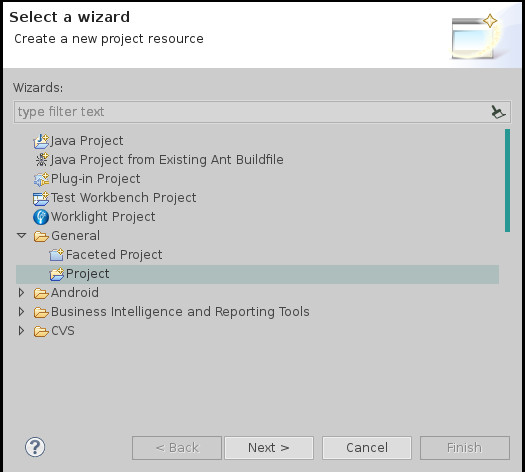
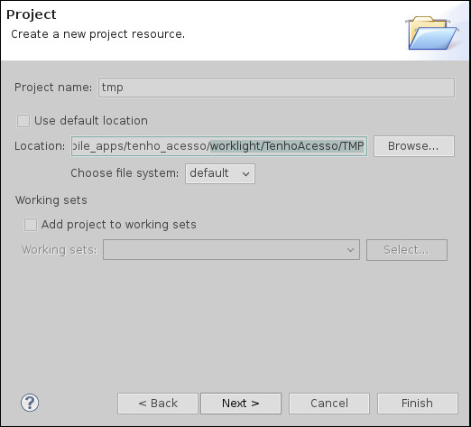

Observações para leitura:
* Quando falo _"este repositório"_, me refiro à cópia local, baixada no computador (resultado de um `git clone`).

# Como importar o projeto no Worklight

Um breve _Hoe To_ de como importar o projeto do _TMP_ para começar a trabalhá-lo no _IBM Worklight_.

## Pré-requisitos

Necessário ter Eclipse instaldo com os plugins ADT e Worklight (items 2 e 3).

1. Eclipse Juno
2. Android Development Tools (ADT)
3. IBM Worklight

Após baixar o Eclipse, ao iniciá-lo pela primeira vez, ele perguntará onde você deseja que seja criada a Workspace.

O diretório escolhido pode ser qualquer lugar que desejar e preferencialmente **NÃO dentro deste repositório _git_** (para evitar inclusão de recursos desnecessários no repositótio).

## Importação do projeto TMP no Worklight

**ATENÇÃO:** Não criar _Novo Projeto do Worklight_.

1. Clique no menu _New_ e em seguida _Project_.
2. Na janela _"Select a wizard"_ (não escolha Gandalf desta vez), selecione _General -> Project_ e clique em avançar.

    

3. Na janela _Project_, dê ao projeto o nome que desejar, **desmarque** a caixa _Use default project location_ e em _Location_, adicione o caminho completo para a pasta `worklight/TenhoAcesso/TMP/` deste repositório. Então clique em avançar.

    

Após isto, vocẽ terá importado o projeto do Eclipse presente no repositório.

Como este projeto já é um projeto do Worklight (reconhecido pelos arquivos de configuração em `.project` e `.settings/`) o Eclipse já disponibiliza todas as opções do mesmo.

# Como compilar e rodar o projeto no navegador

Para testes, utilizamos o Worklight Console.

Após importar o projeto (ou gerar um novo, caso não tenha seguido o tutorial acima) e fazer as modificações necessárias, siga os passos a seguir para compilar e rodar o aplicativo para testes.

1. Localize a pasta `Apps/` dentro de seu projeto no Eclipse.
2. Localize, dentro desta pasta, a pasta com o nome da aplicação.
3. Clique com o botão direito nesta pasta (da Aplicação) e selecione _Run AS -> Build All and Deploy_.
4. Após alguns segundos, o Worklight terá gerado os aplicativos para os dispositivos esperados, e disponibilizará o console em seu **ip principal**, na porta **10080** com o mesmo **nome do projeto**. Por exemplo: [http://127.0.0.1:10080/TenhoAcesso/console](http://127.0.0.1:10080/TenhoAcesso/console).
    1. Alternativamente, você pode clicar com o botão direito no projeto e selecionar _Open Worklight Console_.
5. Acessando o console pelo navegador (Google Chrome é recomendado), basta clicar no  para testar num dispositivo emulado.
